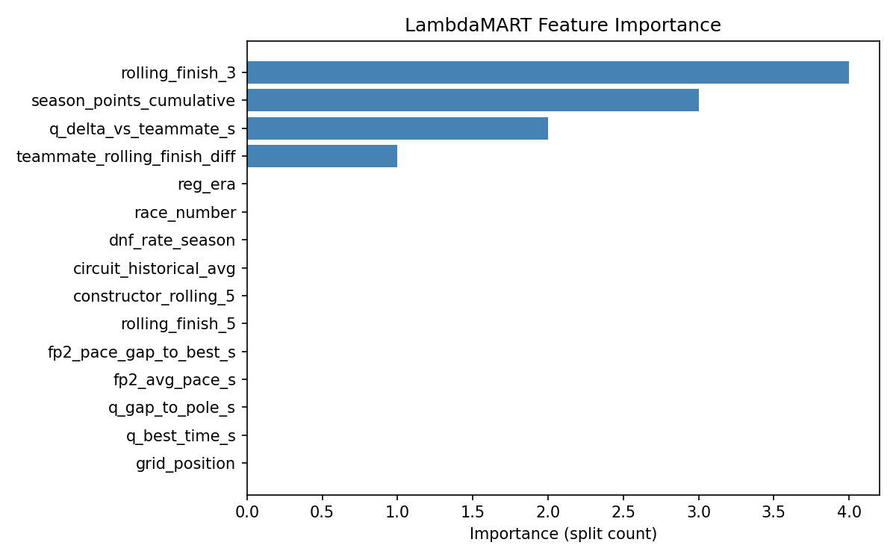
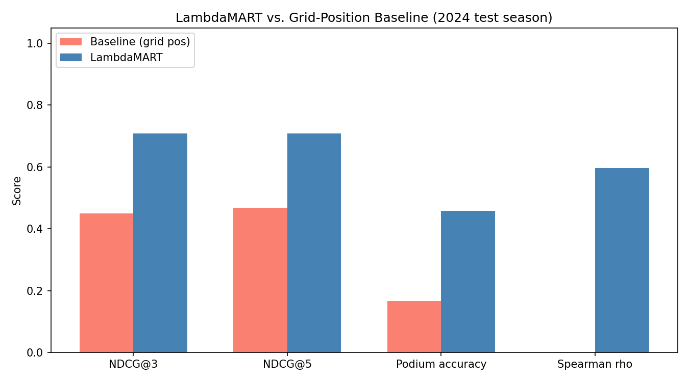
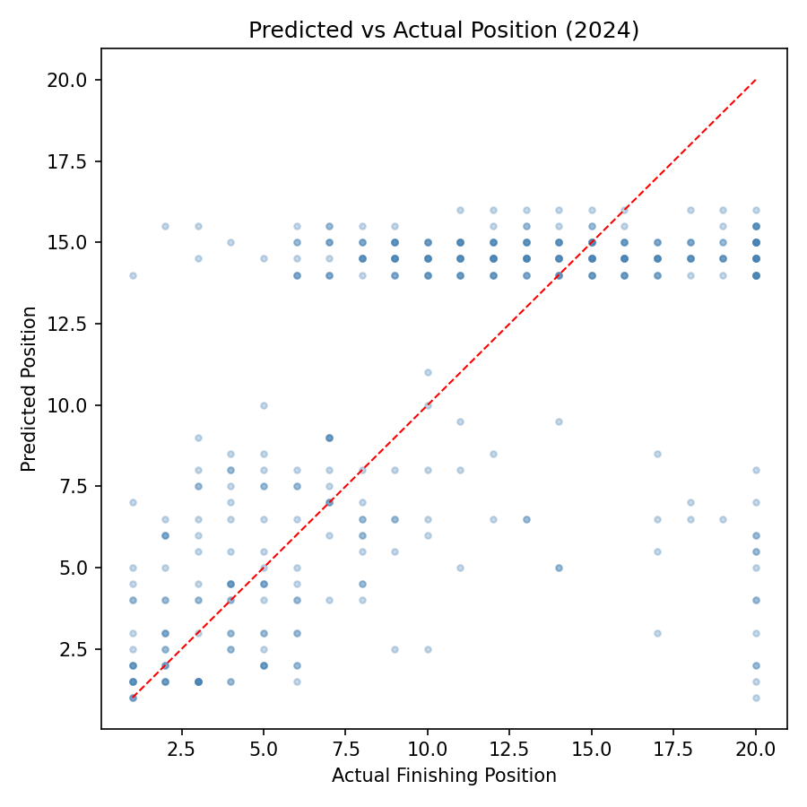

# 🏎️ F1 Race Predictor

A machine learning project that predicts the finishing order of Formula 1 races using historical race results, qualifying performance, practice pace, driver form, constructor performance, and other race-specific features.

The model uses **LambdaMART learning-to-rank** through LightGBM's `LGBMRanker`, making the problem a ranking task rather than simply predicting each driver's finishing position independently.

## Overview

The F1 Predictor collects Formula 1 data using the **FastF1 API**, generates historical and race-specific features, trains a ranking model, and predicts the finishing order for a selected Grand Prix.

The project pipeline is:

```text
FastF1 API
    |
    v
data_loader.py
    |
    v
Raw Race / Qualifying / FP2 Data
    |
    v
feature_engineering.py
    |
    v
Feature Dataset
    |
    v
model.py
    |
    v
LambdaMART Model
    |
    v
predict.py
    |
    v
Predicted Race Finishing Order
```

## Features Used

The model considers several factors that can influence race performance:

- Starting grid position
- Best qualifying lap time
- Gap to pole position
- FP2 long-run race pace
- FP2 pace gap to the fastest driver
- Qualifying performance relative to teammate
- Recent performance relative to teammate
- Driver's average finish over the previous 3 races
- Driver's average finish over the previous 5 races
- Constructor's recent average finishing position
- Driver's historical performance at the circuit
- Driver's season DNF rate
- Cumulative championship points
- Race number within the season
- Formula 1 regulation era

These features allow the model to account for both current weekend performance and longer-term driver/team performance.

## Machine Learning Model

The project uses **LambdaMART**, implemented with:

```python
lightgbm.LGBMRanker
```

LambdaMART is a learning-to-rank algorithm commonly used for ranking problems. Instead of treating finishing positions as unrelated numerical values, the model learns how drivers should be ordered relative to one another.

The model uses the `lambdarank` objective and evaluates rankings using metrics such as **NDCG**.

The project also compares the machine learning model against a simple baseline where drivers are predicted to finish in their starting grid order.

## Project Structure

```text
F1-Predictor/
│
├── data/
│   ├── features.csv
│   ├── fp2_raw.csv
│   ├── qualifying_raw.csv
│   └── race_raw.csv
│
├── models/
│   ├── best_params.json
│   ├── lambdamart_f1.pkl
│   ├── feature_importance.png
│   ├── metrics_comparison.png
│   └── predicted_vs_actual.png
│
├── data_loader.py
├── feature_engineering.py
├── model.py
├── predict.py
├── requirements.txt
└── .gitignore
```

### `data_loader.py`

Downloads Formula 1 data using FastF1.

The script collects:

- Qualifying results
- Race results
- FP2 long-run pace

By default, data is collected for the **2021–2024 seasons**.

FastF1 responses are stored locally in a `cache/` directory to avoid repeatedly downloading the same data.

### `feature_engineering.py`

Combines the raw qualifying, race, and FP2 data and generates the features used by the machine learning model.

The resulting dataset is stored at:

```text
data/features.csv
```

### `model.py`

Trains and evaluates the LambdaMART ranking model.

The script:

- Splits training and testing seasons
- Handles missing feature values
- Scales input features
- Trains a LightGBM ranking model
- Compares the model against grid-position predictions
- Evaluates ranking performance
- Saves the trained model
- Generates model evaluation graphs

The trained model is saved to:

```text
models/lambdamart_f1.pkl
```

### `predict.py`

Predicts the finishing order for a selected Formula 1 race.

For the requested race, the program retrieves qualifying and FP2 information and combines it with historical driver and constructor data.

The script then trains multiple ranking models and selects the model with the best validation NDCG score before producing the final race prediction.

## Installation

### 1. Clone the repository

```bash
git clone https://github.com/AngelCRocha/F1-Predictor.git
cd F1-Predictor
```

### 2. Create a virtual environment

Creating a virtual environment is recommended.

#### macOS / Linux

```bash
python3 -m venv venv
source venv/bin/activate
```

#### Windows

```bash
python -m venv venv
venv\Scripts\activate
```

### 3. Install dependencies

```bash
pip install -r requirements.txt
```

The main libraries used by the project include:

- FastF1
- LightGBM
- Pandas
- NumPy
- Scikit-learn
- Matplotlib
- Seaborn
- Optuna

## Usage

### Step 1 — Download F1 Data

Run:

```bash
python data_loader.py
```

By default, this downloads data from:

```text
2021
2022
2023
2024
```

You can specify your own seasons:

```bash
python data_loader.py --years 2021 2022 2023 2024
```

The generated data will be placed in the `data/` directory.

## Step 2 — Generate Features

Run:

```bash
python feature_engineering.py
```

This combines the downloaded data and creates:

```text
data/features.csv
```

## Step 3 — Train the Model

Run:

```bash
python model.py
```

The default configuration trains on:

```text
2021
2022
2023
```

and tests on:

```text
2024
```

You can specify different years:

```bash
python model.py --train-years 2021 2022 2023 --test-year 2024
```

### Hyperparameter Tuning

The project also supports hyperparameter optimization using Optuna.

```bash
python model.py --tune
```

The number of trials can be changed:

```bash
python model.py --tune --n-trials 100
```

The best parameters are saved to:

```text
models/best_params.json
```

## Step 4 — Predict a Race

To predict a race, provide the season and round number.

For example:

```bash
python predict.py --year 2024 --round 5
```

The program will retrieve the race's qualifying and FP2 information and output the predicted finishing order.

Example output:

```text
==============================================================================
  Miami Grand Prix 2024
==============================================================================

   #  Driver                      Team                   Grid
  ------------------------------------------------------------
   1  Driver Name                 Team Name                 2
   2  Driver Name                 Team Name                 1
   3  Driver Name                 Team Name                 4
   ...
==============================================================================
```

## Compare Predictions With Actual Results

For completed races, the prediction can be compared directly against the actual race results:

```bash
python predict.py --year 2024 --round 5 --show-actual
```

The program displays the predicted and actual finishing order side-by-side.

It also calculates:

- Exact finishing-position matches
- Top-3 accuracy
- Top-5 accuracy
- Top-10 accuracy
- Spearman rank correlation

## Multiple Training Runs

Because model training can produce slightly different results depending on the random seed, `predict.py` trains multiple models and chooses the model with the best validation performance.

The default is:

```text
10 runs
```

You can change this using:

```bash
python predict.py --year 2024 --round 5 --runs 20
```

## Model Evaluation

Training generates several visualizations inside the `models/` directory.

### Feature Importance



Shows which features have the greatest influence on the LambdaMART model.

### Model vs. Baseline



Compares the LambdaMART model against predictions based purely on starting grid position.

### Predicted vs. Actual Results



Visualizes predicted finishing positions against actual race results.

## Data Source

Formula 1 session information is retrieved using the **FastF1** Python library.

The project uses information including:

- Race results
- Qualifying results
- Driver information
- Constructor information
- Practice session lap data

FastF1 locally caches downloaded data in:

```text
cache/
```

The cache directory is intentionally excluded from Git because FastF1 cache files can become very large.

## Technologies

**Language**

```text
Python
```

**Machine Learning**

```text
LightGBM
LambdaMART
Scikit-learn
Optuna
```

**Data Processing**

```text
Pandas
NumPy
```

**Formula 1 Data**

```text
FastF1
```

**Visualization**

```text
Matplotlib
Seaborn
```

## Future Improvements

Potential improvements to the predictor include:

- Weather conditions
- Tire compound and tire degradation data
- Driver race-pace consistency
- Pit stop strategy
- Safety car probability
- Track temperature
- Rain probability
- Starting tire compound
- Constructor upgrades throughout the season
- Track-specific car characteristics
- More historical seasons
- Separate sprint-weekend handling
- Live race-weekend predictions

## Disclaimer

This project is intended for educational and experimental machine learning purposes.

Formula 1 race results are influenced by many unpredictable events, including crashes, mechanical failures, weather, safety cars, penalties, and strategy decisions. Predictions should therefore not be interpreted as guaranteed race outcomes.

## Author

**Angel Rocha**

GitHub: [AngelCRocha](https://github.com/AngelCRocha)

Project Repository: [F1-Predictor](https://github.com/AngelCRocha/F1-Predictor)
